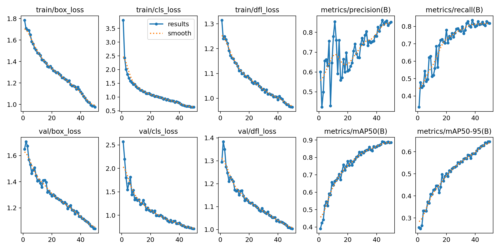

# AI Computer Vision Squat Tracker (WIP)
Senior capstone: real time squat form feedback using object detection and pose estimation.

## What this repo shows now
- Dataset and YOLOv8 training via Roboflow (see `/notebooks/ModelTraining - Colab.pdf`)
- Training curves and metrics (see `/results`)
- Team workflow notes (see `/docs`)

## Stack
Python • Ultralytics YOLOv8 • OpenCV • (planned) MediaPipe/MoveNet • FastAPI

## Results (Model V1)
Training improves across 50 epochs. Precision, recall, and mAP trend up.

## Roadmap
- [ ] Pose angle metrics (hip, knee, ankle)
- [ ] Rep segmentation and depth heuristic
- [ ] FastAPI `/predict` endpoint for feedback
- [ ] Front end upload flow on Figma

## Credits
Team: Christian (model training), Matt (repo setup, docs, prototyping), Gil (wireframes), Finn (ethics/datacollection), Cephas (dev support).

> Note: My laptop was wiped during repair. I am rebuilding repos and pushing code as we sync group work. This README and artifacts reflect active progress.
